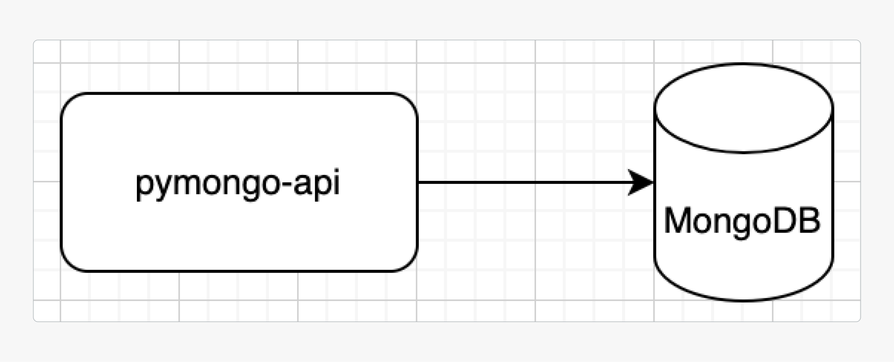

# Задание 1. Планирование

Ваша задача — реализовать шардирование, репликацию и кеширование. Чтобы это сделать, спланируйте изменения.

> [Шаблон схемы](task1_template.drawio) исходного приложения в draw.io.
> 
> 

На основе этого шаблона вам нужно создать схему итогового решения. Рекомендуем работать над ней в несколько этапов. Вот первые три шага:

1. Подготовьте первый вариант схемы. Изобразите, как вы будете использовать шардирование в MongoDB, чтобы повысить производительность. Двух шардов будет достаточно.

2. Составьте второй вариант схемы. Изобразите, как будет реализована репликация MongoDB для повышения отказоустойчивости. Чтобы это сделать, скопируйте первый вариант схемы и доработайте его, чтобы для каждого шарда была настроена репликация. На этом этапе у каждого шарда должно быть по три реплики.

3. И наконец, на третьем варианте схемы изобразите вашу реализацию кеширования, чтобы повысить производительность ещё больше. Чтобы это сделать, скопируйте второй вариант схемы и добавьте инстанс Redis для кеширования запросов приложения к MongoDB.

## На что будет смотреть ревьюер:

- На схемах укажите инстанс приложения и все инстансы инфраструктурных сервисов, а также их типы (`pymongo-api`, `configSrv`, `redis`, `shard1-1`, `shard1-2` и т. п.). Имена сервисов можно взять из примеров, которые описаны в уроках.
- Выделите группы репликации.
- Отобразите стрелками сетевые взаимодействия между сервисами.
