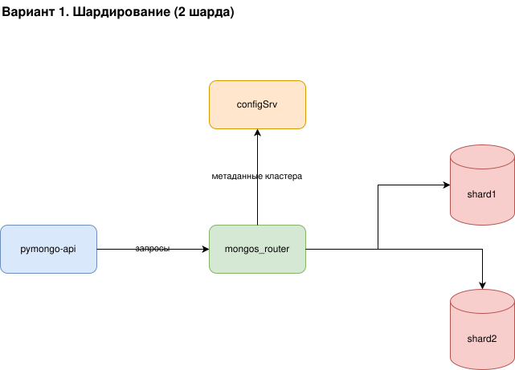
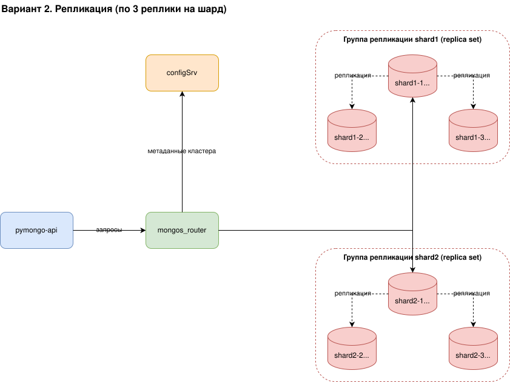
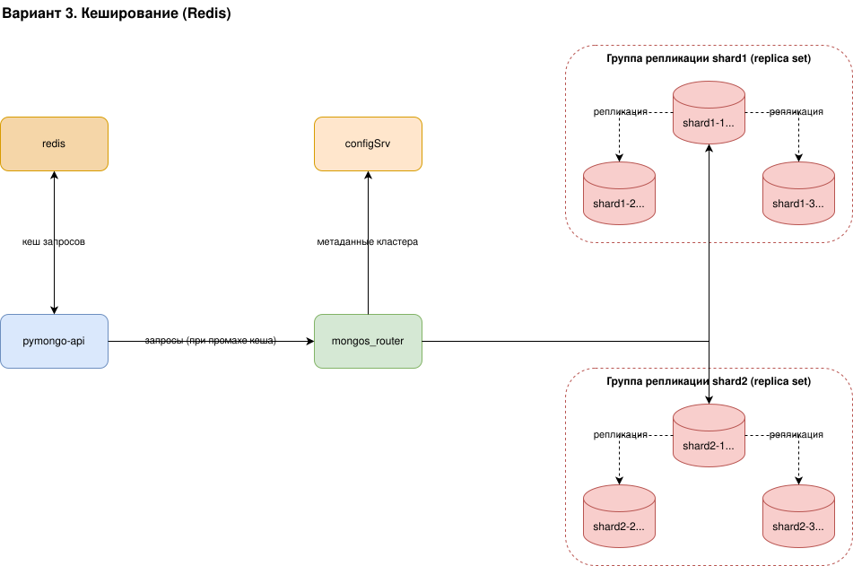

# Задание 1. Планирование

Спланированы изменения для повышения производительности и отказоустойчивости
взаимодействия `pymongo-api` с MongoDB. Подготовлены три варианта схемы, каждый
следующий дорабатывает предыдущий.

## Вариант 1. Шардирование

[task1_1_sharding.drawio](task1_1_sharding.drawio)

Чтобы распределить нагрузку, данные разбиваются на 2 шарда. Появляются новые
инфраструктурные сервисы:

- `pymongo-api` - инстанс приложения.
- `mongos_router` - роутер запросов, единая точка входа в кластер. Приложение
  обращается только к нему.
- `configSrv` - конфигурационный сервер, хранит метаданные кластера и карту
  распределения данных по шардам.
- `shard1`, `shard2` - два шарда, между которыми распределяются данные.

Взаимодействия: `pymongo-api` -> `mongos_router`; `mongos_router` -> `configSrv`;
`mongos_router` -> `shard1`; `mongos_router` -> `shard2`.

## Вариант 2. Репликация

[task1_2_replication.drawio](task1_2_replication.drawio)

Схема варианта 1 дополнена репликацией: каждый шард становится группой репликации
(replica set) из трёх нод. Если падает PRIMARY, одна из SECONDARY становится новым
PRIMARY, и кластер продолжает работать.

- Группа репликации `shard1`: `shard1-1` (PRIMARY), `shard1-2` (SECONDARY),
  `shard1-3` (SECONDARY).
- Группа репликации `shard2`: `shard2-1` (PRIMARY), `shard2-2` (SECONDARY),
  `shard2-3` (SECONDARY).

Внутри каждой группы пунктирными стрелками показана репликация данных от PRIMARY
к SECONDARY. `mongos_router` направляет запросы на PRIMARY каждого шарда.
`configSrv` оставлен одним инстансом - по заданию три реплики нужны только для
шардов.

## Вариант 3. Кеширование

[task1_3_caching.drawio](task1_3_caching.drawio)

Схема варианта 2 дополнена инстансом `redis` для кеширования запросов приложения
к MongoDB.

- `pymongo-api` <-> `redis` - приложение сначала проверяет кеш.
- При промахе кеша `pymongo-api` -> `mongos_router` идёт в кластер, а результат
  кладётся в `redis`.

Кеширование снижает количество обращений к MongoDB и дополнительно повышает
производительность на частых одинаковых запросах.

## Итоговый состав сервисов

- `pymongo-api` - инстанс приложения.
- `mongos_router` - роутер запросов, точка входа в шардированный кластер.
- `configSrv` - конфигурационный сервер с метаданными кластера.
- `shard1-1` ... `shard1-3` - группа репликации первого шарда.
- `shard2-1` ... `shard2-3` - группа репликации второго шарда.
- `redis` - кеш запросов к MongoDB.
