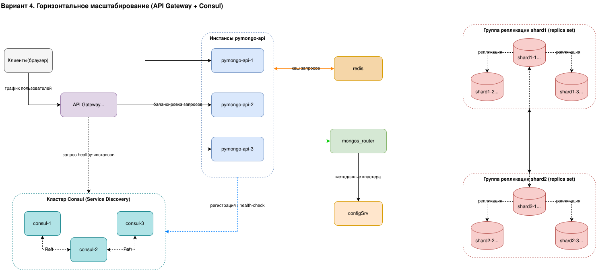

# Задание 5. Service Discovery и балансировка с API Gateway

Четвёртый вариант схемы. Это копия третьего варианта (кеширование), дополненная
горизонтальным масштабированием приложения: несколькими инстансами `pymongo-api`,
балансировкой через API Gateway и Service Discovery через Hashicorp Consul.

## Вариант 4. Горизонтальное масштабирование

[task5_4_scaling.drawio](task5_4_scaling.drawio)

### Что добавилось к варианту 3

- Вместо одного инстанса приложения теперь несколько: `pymongo-api-1`,
  `pymongo-api-2`, `pymongo-api-3`. Их количество можно менять, не останавливая
  сайт - при обновлении или росте нагрузки.
- `API Gateway` - единая точка входа для клиентов. Распределяет (балансирует)
  входящий трафик между живыми инстансами приложения.
- Кластер `Consul` из трёх нод (`consul-1`, `consul-2`, `consul-3`) отвечает за
  Service Discovery: хранит актуальный список инстансов и их состояние. Три ноды
  нужны для кворума и отказоустойчивости самого Consul.

### Как это работает

- Клиенты обращаются только к `API Gateway`.
- Каждый инстанс `pymongo-api` при старте регистрируется в Consul и периодически
  проходит health-check. Когда инстанс добавляют или удаляют, Consul обновляет
  список.
- `API Gateway` берёт из Consul список здоровых инстансов и балансирует трафик
  только между ними. Так упавшие или удалённые инстансы автоматически выпадают из
  балансировки, а новые - попадают в неё.
- Ноды Consul синхронизируют состояние между собой (Raft).
- Каждый инстанс приложения, как и в варианте 3, сначала проверяет `redis`, а при
  промахе кеша идёт через `mongos_router` в шардированный и реплицированный
  кластер MongoDB.

### Сетевые взаимодействия

`API Gateway` соединён с каждым инстансом отдельной стрелкой, чтобы показать
балансировку. Связи тира приложения с `Consul`, `redis` и `mongos_router` для
читаемости показаны одной стрелкой от группы инстансов - они одинаковы для
каждого инстанса.

- `Клиенты` -> `API Gateway` - трафик пользователей.
- `API Gateway` -> `pymongo-api-1`, `pymongo-api-2`, `pymongo-api-3` - балансировка запросов.
- `API Gateway` -> `Consul` - запрос списка здоровых инстансов.
- Группа инстансов `pymongo-api` -> `Consul` - регистрация и health-check.
- `consul-1` <-> `consul-2` <-> `consul-3` - синхронизация состояния (Raft).
- Группа инстансов `pymongo-api` <-> `redis` - кеш запросов.
- Группа инстансов `pymongo-api` -> `mongos_router` - запросы при промахе кеша.
- `mongos_router` -> `configSrv` - метаданные кластера.
- `mongos_router` -> `shard1-1`, `shard2-1` - запросы к PRIMARY каждого шарда.
- Внутри каждого шарда - репликация от PRIMARY к SECONDARY.

## Итоговый состав сервисов

- `API Gateway` - точка входа, балансировка трафика между инстансами.
- `consul-1` ... `consul-3` - кластер Service Discovery, реестр живых инстансов.
- `pymongo-api-1` ... `pymongo-api-3` - инстансы приложения (горизонтальное масштабирование).
- `redis` - кеш запросов к MongoDB.
- `mongos_router` - роутер запросов, точка входа в шардированный кластер.
- `configSrv` - конфигурационный сервер с метаданными кластера.
- `shard1-1` ... `shard1-3` - группа репликации первого шарда.
- `shard2-1` ... `shard2-3` - группа репликации второго шарда.
