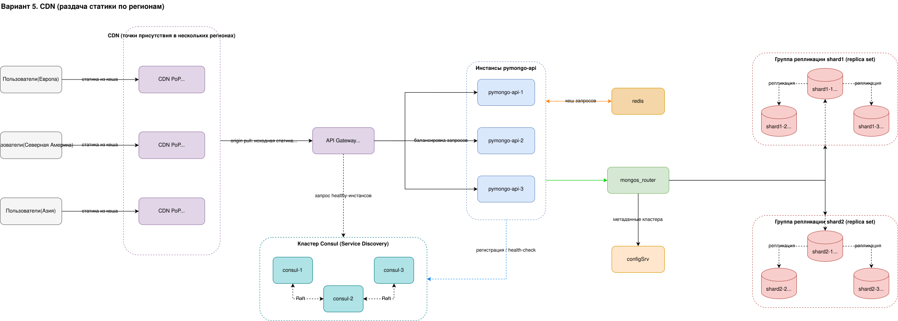

# Задание 6. CDN

Пятый вариант схемы. Это копия четвёртого варианта (горизонтальное
масштабирование), дополненная сервисом CDN с точками присутствия (PoP) в
нескольких регионах для ускоренной доставки статического контента.

## Вариант 5. CDN

[task6_5_cdn.drawio](task6_5_cdn.drawio)

### Что добавилось к варианту 4

- `CDN` - сеть доставки контента с точками присутствия (PoP) в нескольких
  регионах: `CDN PoP (Европа)`, `CDN PoP (Северная Америка)`, `CDN PoP (Азия)`.
  Каждая PoP кеширует статику (JS, CSS, изображения, шрифты) рядом с
  пользователями.
- Пользователи разбиты по регионам: `Пользователи (Европа)`,
  `Пользователи (Северная Америка)`, `Пользователи (Азия)`.

### Как это работает

- Запрос пользователя попадает на ближайшую к нему точку присутствия CDN. Так
  статика отдаётся с минимальной задержкой, а трафик не уходит каждый раз в
  основной дата-центр.
- Если статики в кеше PoP нет (первый запрос или истёк TTL), CDN идёт за ней в
  origin - то есть в инфраструктуру онлайн-магазина через `API Gateway` к
  инстансам `pymongo-api`. Это называется origin pull. Полученный объект
  кешируется на PoP и дальше отдаётся из кеша.
- Динамические запросы (API, оформление заказа) не кешируются: CDN проксирует их
  в тот же origin (`API Gateway`), а дальше работает схема варианта 4 -
  балансировка между инстансами, Service Discovery через Consul, кеш в `redis` и
  шардированный с репликацией кластер MongoDB.

### Откуда CDN берёт статический контент

Источник (origin) статики - сама инфраструктура магазина: `API Gateway` и за ним
инстансы `pymongo-api`. CDN не хранит контент постоянно, а подтягивает его из
origin по требованию (origin pull) и кеширует на PoP. На схеме это показано
стрелкой от группы `CDN` к `API Gateway` с подписью
"origin pull: исходная статика".

### Сетевые взаимодействия

- `Пользователи (Европа/Северная Америка/Азия)` -> ближайшая `CDN PoP` - статика
  из ближайшего кеша.
- `CDN` -> `API Gateway` - origin pull исходной статики и проксирование
  динамических запросов.
- Дальше всё как в варианте 4 (см. задание 5): балансировка по инстансам,
  Service Discovery через Consul, кеш в `redis`, шардированный и реплицированный
  кластер MongoDB.

## Итоговый состав сервисов

- `CDN PoP (Европа/Сев. Америка/Азия)` - точки присутствия CDN, кеш статики рядом с пользователями.
- `API Gateway` - origin-точка входа, балансировка трафика между инстансами.
- `consul-1` ... `consul-3` - кластер Service Discovery, реестр живых инстансов.
- `pymongo-api-1` ... `pymongo-api-3` - инстансы приложения (origin для статики и API).
- `redis` - кеш запросов к MongoDB.
- `mongos_router` - роутер запросов, точка входа в шардированный кластер.
- `configSrv` - конфигурационный сервер с метаданными кластера.
- `shard1-1` ... `shard1-3` - группа репликации первого шарда.
- `shard2-1` ... `shard2-3` - группа репликации второго шарда.
